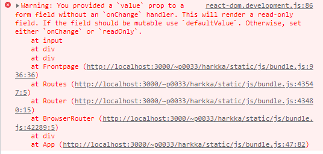

# pic-app Raportti
      
##  7.7. 

Meni 2 tuntia, tein projektin rungon create-react-appilla, hyväksytin aiheen opettajalla

Suunnitelmana siis minimissään ottaa Pixabayn APIsta kuvia. 
        
Jos se onnistuu, käyttäjä voisi valita randomeista kuvista mieleisen ja kirjoittaa tekstin ja tallentaa "kortin". Mahdollisesti hakukentästä valita hakusanalla kuvia.
        
Jos sekin onnistuu, sitten kokeillaan firebaseen korttien tallennusta jne.
        

    
##  8.7. 

Aamulla 20 minuuttia Axioksen asennus ja pohdintaa miten se otetaan käyttöön.
Päivällä 60 minuuttia.  Sain Axioksen käyttöön ja sieltä jopa oikeita osoitteita, vielä mietintää miksi kuvat ei näy. Aa, yhdet aaltosulut poisti niin sitten lähti näkymään. Nyt toimii niin, että nappia painamalla tulee listana kuvia, joissa on hakusana "yellow flowers" (Pixabayn API:n esimerkki). Tästä on hyvä lähteä laajentamaan.
        

    
Yhteensä käytetty aikaa 3 tuntia 20 minuuttia /40t.
    
## 9.7. 

n. 2 tuntia.

Nyt ohjelmalla voi etsiä millä hakusanalla vain Pixabayn kuvista. CSS on ok:lla tolalla.


Loin jo staten "valittu kuva". Nyt sitten seuraavaksi tehdään niin, että käyttäjä voi valita kuvan,
ja se kuva tulee isompana näkyviin sivun ylälaitaan. Se ei tosin vielä onnistu, valittaa jotain synteettistä tapahtumaa eikä mitään tule img-elementtiin näkyviin. Tuo synteettinen tapahtuma oli
aiemminkin ongelma ja ratkaisin sen kyllä, mutta nyt ei aukene. Jatkuu seuraavalla kerralla.

Yhteensä käytetty aikaa 5t 20min /40t.

## 11.7. 

Siis ideana olisi, että käyttäjä vois ettiä kuvia haluamallaan hakusanalla (tehty) ja valita niistä yhden joka sitten tulis ylös näkyville "valintaruutuun" (div?) ja sitten ku käyttäjä on tyytyväinen valintaan, se vois kirjottaa viestin input fieldiin ja sitten tallentaa kortin. Nyt toimii kuvan valitseminen listassa olevista kuvista. Lähdin sitten yrittämään implementoida Masonry-galleriaa noista kuvista, niin tulevat kivemmin esille. No nyt toimii Masonry-galleria.


        
Yhteensä käytetty aikaa 7 t 30min /40t.
    
##    12.7. 

Tänään lähinnä suunnittelin sitä, että mitkä asiat pitäisi olla omissa komponenteissaan, ja missä tilojen pitäisi sijaita. Eli pitäisikö staten olla App.js:ssä, ja sieltä se jotenkin jakaa eri sivuille, vai kullakin sivulla eri state. Suunnitelmana siis olisi, että react-routerilla tekisin vaihdon kolmen sivun välillä: 1. sivulla on etusivu, jossa on napit, joilla liikutaan joko CreateCard-sivulle tai ShowAllCards-sivulle. Eli yhteensä kolme sivua, joilla liikennöidään react-routerin avulla. Päädyin siihen, että luulen että etusivu ei tarvitse statea ollenkaan (ellen tee jotain autentikaatiota), CreateCard tarvitsee tällä hetkellä App.js:ssä olevat statet ja asiat, ja sitten ShowAllCards-sivu sisältää oman staten, jossa kai säilytetään (oletettavasti Firebasesta?) saatuja kortteja. 

Tein nyt npm run build-komennolla tästä minimiversion, jotta on jo yksi toimiva versio.

Yhteensä käytetty aikaa 9t 15min /40t.
    

##  13.7. 

Tänään etsin tietä siitä miten reactRouteria käytetään, ja miten Firebase saadaan kytkettyä appiin. Myös sitä, miten reactRouterilla saisi iskettyä propseja sivulta toiselle.

Yhteensä käytetty aikaa 10t 35min /40t. Kysyin myös opettajalta paljon siitä minimistä saisi arvosanaksi, niin tiedän kuinka paljon laajentaa.
    
##  15.7. 

Tänään oli hankalaa päättää laitanko Githubiin vai Gitlabiin. Laitoin sitten Gitlabiin. 
Kesti tuhottomasti aikaa luoda repo jotain kuusi kertaa kun ensin se meinasi mennä projekti-kurssin alle. Huooh. Mutta nyt se on ylhäällä.

Tänään ei ollut vahva kehityspäivä. Mutta ope sanoi että jo siitä, että saan kuvia etsittyä ja valittua yhden kuvan saisi 3-4 arvosanan kokonaiskurssista. Lähden silti alkuperäisellä suunnitelmalla laajentamaan sen minkä pystyn. Muunsin tämän dokumentin vielä markdowniksi.
Aikaisemmin se oli html-tiedosto. Ajattelin että markdownilla on kätevämpi raportoida tätä etenemistä.

Nyt App-komponentissa on CreateCard-komponentti, joka sisältää kaiken mikä aikaisemmin oli App.js:n sisällä, eli siellä on kuvahaku ja kuvan valinta jne. Muutin myös funktiot nuolifunktioiksi.


Nyt on kaikki komponentit samalla sivulla.


Seuraavaksi yritän muodostaa jonkin asteista react-routeria noista eri komponenteista/sivuista.
Tällä hetkellä ei vielä toimi. Pitää tutustua siihen miten noita patheja oikeasti laitetaan.

Yhteensä 12t 45 min /40t.

## 16.7.

Sain tällä kertaa React-routerin renderöitymään, mutta vielä tällä hetkellä vaikka klikkaa linkkejä, ei pääse pois etusivulta, joka on se default.


En tiedä miksi ei toimi. Ihmettely jatkuu seuravalla kerralla. Katsoin yhden videonkin, ja sillä se toimii juuri noin kuin olen laittanut. Ei pitäisi olla deprekoitunutkaan. Kumma juttu.


Eli Reactin devtoolsien mukaan vaikka linkki on AllCardsiin, se näkyy "/" eli homepagena.

Okei, vielä kokeilin lisätä Outletin, ja nyt ainakin tulee homepagen lisäksi näkyviin nuo muut sisällöt. Vielä ei ihan toimi halutusti, mutta lähempänä ollaan.


1t 35min eli yhteensä 14t 30 min /40t.

## 17.7.

Yritin vielä vähän React-routeria, mutta ei onnistu. Nyt ainakin tulee etusivun alle linkatun sivun sisältö, mutta niin tuli eilenkin, eli ei edistytty.

Yhteensä 14t 50 min /40t.

## 18.7.

No nyt toimii React-routeri niin, että on 3 eri sivua joiden välillä navigoidaan!

Laitoin vielä vähän CSS-juttuja paikoilleen niin näyttää asiat paremmalta CreateCardissa ja
Appissa.

Pohdin vielä onko stateja liikaa ja kannattaako Linkit pitää.

Meni 85 min. Yhteensä siis 16t 15min /40t käytetty.

## 19.7.

Muokkasin CSS:ää ja muutin kortin tekstin textareaksi.

25 min eli yhteensä 16t 40min /40t käytetty.

## 21.7.


CSS Frontpageen ja CreateCardiin.

Yritän saada CreateCardin submitin toimimaan. Submit kyllä toimii, mutta pohdin pitäisikö submittia painaessa tehdä oma komponentti joka tulee esiin kun on painettu. En vielä osaa navigoida noilta sivuilta toiselle useNavigatella, se antaa virhettä.

Pohdin teenkö juuri submitatun kortin näyttämisen alertilla, sitten ei tarvitsisi navigoida muualle. Toisaalta ehkä helpoin vain tehdä uusi komponentti. Oho, sehän tuli helposti. Eli laitoin conditional renderingillä siten, että CreateCard-sivulle joko renderöidään se luomisosio tai luotu kortti.

Nyt näkyy tällä tavalla ennen kun käyttäjä on submitannut kortin.


Nyt näkyy tällä tavalla kun käyttäjä on submitannut kortin.


Ideaalitilanteessa tähän sitten laittaisi vielä linkit "Lähetä uusi kortti" ja "Näytä kaikki kortit". Pitää saada tuo navigaatio toimimaan.

No niin, nyt näyttää kortin submittaaminen kivalta.


2t 45 min, eli yhteensä 19t 25min / 40t käytetty.

## 22.7.

Ajoin uuden build-version koodista joka on 21.7. versiosta. Siinä voi tehdä kortin ja se tulee ruutuun näkyviin itsenään
kun sen on luonut.

Nyt yritän saada textarean rivejä talteen riveinä. Sieltä ensin tuli kaikki kirjaimet erikseen kun olin unohtanut laittaa "\n"- merkin splittiin, mutta nyt se toimii.


Ajoin vielä uuden buildin.

No niin, korjasin frontpagen polun että se on /, koska muuten tulisi erroria harkka/ -sivusta.

Lisäsin myös linkit kaikkialle, mukaanlukien etusivulle.

Ja nyt lisäsin staten allCards tuonne App.js:n, joten nyt voi tehdä uuden kortin ja ne tulevat sinne kaikki kortit sisältävälle AllCards-sivulle. Eli näin:


Olen nyt tosi pitkällä tässä, melkein olisi jo valmis kurssin puolesta. Itse aion jatkokehittää tätä, mutta siis tämähän on oikein kunnon peli.

Ajan vielä uuden buildin niin katsotaan palvelimella miten tämä toimii. Laitoin myös linkin sille CardCreated-sivulle, jotta voidaan sieltä suoraan palata CreateCardiin luomaan uusi kortti. Ah, se linkki ei vielä toimi. Myöskin on häikkää siitä, että miten sivun osoitteet toimivat. https://student.labranet.jamk.fi/~p0033/harkka/ antaa erroria, ja / laittamalla frontpageen tullaan https://student.labranet.jamk.fi/ sivulle, joka jostain syystä näyttää minun etusivuani. CreateCard näkyy osoitteessa https://student.labranet.jamk.fi/createcard ja https://student.labranet.jamk.fi/allcards
samoin löytyy suoraan sen alta. Ihme juttu.

Kokeilen seuraavalla kerralla antaa BrowserRouterille basenamen.

Tänään 2t 45 min, eli yhteensä on mennyt 22t 10min /40t.

## 23.7.


Yritän nyt saada ne linkit toimimaan järkevästi. Yritin saada CreateCardsiin ehdollisen renderöinnin niin että sieltä pääsisi takaisinkin, koska nyt kun yritän CardCreatedistä tulla takaisin, polku on createcard/createcard. Taidan laittaa kaiken takaisin.

Kun kirjoitan näin:

```
<div className="App">
      <BrowserRouter basename="/~p0033/harkka/">
        <ul className="LinkList">
          <li>
            <Link to="/~p0033/harkka/">Front page</Link></li>
          <li><Link to="/~p0033/harkka/createcard">CreateCard</Link></li>
          <li>
            <Link to="/~p0033/harkka/allcards">AllCards</Link></li>
        </ul>
        <Routes>
          <Route path="/~p0033/harkka/createcard" element={<CreateCard handleri={addCard}/>} />
          <Route path="/~p0033/harkka/allcards" element={<AllCards getteri={allCards}/>} />
          <Route path="/~p0033/harkka/" element={<Frontpage />} />
          <Route path="*" element={<ErrorPage />} />
        </Routes>
      </BrowserRouter>
    </div>
```

Tulee seuraavan kuvan kaltainen url kun klikataan etusivulle. Joten ei niinkään. Olen siis package.jsonissa määrittänyt että nettisivuni homepage on https://student.labranet.jamk.fi/~p0033/harkka/.


Kokeilen seuraavaa.

```<div className="App">
      <BrowserRouter basename="/~p0033/harkka/">
        <ul className="LinkList">
          <li>
            <Link to="/">Front page</Link></li>
          <li><Link to="/createcard">CreateCard</Link></li>
          <li>
            <Link to="/allcards">AllCards</Link></li>
        </ul>
        <Routes>
          <Route path="/createcard" element={<CreateCard handleri={addCard}/>} />
          <Route path="/allcards" element={<AllCards getteri={allCards}/>} />
          <Route path="/" element={<Frontpage />} />
          <Route path="*" element={<ErrorPage />} />
        </Routes>
      </BrowserRouter>
    </div>
```

Tuo kävisi ainakin järkeen. Huh, viimein toimii.

Eiköhän tämä ole tässä.

Yhteensä 2t, eli yhteensä 24t 10 min /40t käytetty projektiin.

## 25.7.

Kommentoin koodia ja poistan turhia osia. Siirrän myös frontpagen muuttamaan nimi-statea. Eli nimiInput state siirtyy nyt App.js:n. Heittää vielä erroria ettei FrontPagessa nyt muka ole onChange-funktiota, mutta sillä on? Mutta nyt tuo kenttä on read-only tilassa sen takia.



No niin, kyseessä oli se, että olin antanut propsiksi nimihandleri, mutta siellä itse FrontPage-komponentissa viittasin itse funktion nimeen. Nyt siis toimii homma.

Jäljellä enää localStorageen tuon allCards-staten laitto, ja laitan componentdidmounttiin kolme korttia jo valmiiksi. Ja ehkä vähän CSS-fuuta AllCardsiin myös, niin diveissä on paddingia.

Yhteensä 1t 30 min, eli yhteensä 25t 40 min/40t käytetty projektiin.

## 26.7.

Local storagen lisäämisen tutkimista. Saattaa jo toimia lisääminen, pitää katsoa kun ajaa.

Listaan tähän alle ne valmiit kortit jotka lisään useEffectissä. UseEffect on ilmeisesti Hook-versio componentDidMountista-luokkapuolella.

Yksi kortti 

src: "https://pixabay.com/get/gb8085ca5c321ca016ff45349e5f1a7c1f55dad6028948a5cd386a70ec6a45141715d698009ce1aadb57866761d38ce052ceff843b2e29a022c9be0058072ec87_1280.jpg"
text: "Moi äiti!\nMiten menee"
user: "Maarit"

Toka kortti

src: "https://pixabay.com/get/g88009c1c7f636f59c8afff6fd751a4531cc82abe02c86f52712d9b285dfa5ab4f11780ccb2f2eb43f69b55e4e6c707718042a88032ea786b10e0452dd2c18c02_1280.jpg"
text: "Moi iskä!\nHyvää Kuopiota!"
user: "Maarit"

Kolmas kortti

src: "https://pixabay.com/get/g5fa8a5b3a43a813e81b01c364af3c57ca3ed079f5218c6f69d99a683c9085122d52236fe2bbd457607bea72205fe34a89323a24815724a712f67d082c0dc8224_1280.jpg"
text: "Moi sisko!\n\nTerkkuja Kanarialle!"
user: "Maarit"

Laitan nuo JSON-tiedostoon nimeltä cards.json.

Laitoin myös AllCardsin css:n kuntoon, nyt kortit näyttävät tältä.


Paljon siistimmät noin. Laitoin vielä rivityksen vasemmalle kortin tekstin suhteen. Minusta se näyttää kivalta noin, että käyttäjä keskellä ja teksti vasemmalla. Hmm. Navi on nyt myös vasemmalla. Toisaalta se on ihan kiva noinkin. No, laitoin niin että navi on keskellä.


Tällä hetkellä koko appi näyttää tältä AllCards-sivua katsoessa.


Vielä ei toimi tuo axioksella lokaali json-filen importtaaminen. Olen importannut tiedoston, ja kutsun sitä axioksella, mutta tulee uncaught in promise erroria.


Ahaa, axios ei osaa lukea lokaalisti, vain netissä. Eli laitan json-tiedoston palvelimelle ja sieltä luen. No, uusi error.


Ilmeisesti pitää sallia CORS .htaccess filussa tai jossain. No niin, .htaccess filu näyttää nyt tältä.


Ja nyt toimii. 


Okei, nyt toimii, mutta vaikka niitä on vain kolme, ne laitetaan tosi moneen kertaan sivulle. Siis niin moneen kertaan että hirvittää. Aa, useEffectiin piti laittaa toinen parametri. Muuten se laitetaan aina kun sivu renderöidään, ja sivu renderöidään varmaan uudestaan kun kortteja lisätään. No, se silti laittaa ne sinne kahdesti. Hm. Ehkä sitä ei kannata laittaa App.js:n, koska sittenhän se renderöidään uusiksi aina kun App.js renderöidään uusiksi. Eli laitan sen suoraan AllCardsiin. useEffect valittaa puuttuvasta propsista. Ja edelleen tulee kahdesti samat kortit toiseen kertaan. Ajan vielä yhden buildin.

Tässä siis esimerkki siitä että ne tulevat uudestaan, joka kerralla kun sivulle tullaan. Kuva otettu buildista.


Päätin että laitan useEffectiin ehdon, että siellä sisällä oleva axios-haku tehdään ainoastaan jos defaultCardsAdded-state on false. Sitten pitäisi tulla vain kerran.

Okei, vaati localStoragen kanssa iffittelyä, mutta nyt vain kerran sessiossa nuo json-tiedostossa olevat jutut laitetaan näkyviin. Ja nyt on localStoragekin mukana projussa.


3 tuntia 15 minuuttia, mutta nyt toimii localStorage ja proju on loppu tämän kurssin osalta!

Yhteensä projuun tähän mennessä 28t 55min /40t. Vielä pitää tehdä esittely tästä.

Tein vielä esittelysivua. Pohdin komponenttien suhteita toisiinsa. Piirsin DrawIo kuvaa.

Vielä meni 55 minuuttia.

Yhteensä 29t 50 minuuttia /40t.

## 27.7.

Tein esittelyä. Tajusin, että vielä tämä on jotenkin rikki. AllCardsiin ei tule ne valmiit kortit ja aiemmin CardCreatedista ei linkki toiminut AllCardsiin. No, linkki toimii nyt, mutta localStorage ei toimi kuten luulin, eikä myöskään sessionStorage jota kokeilin. Siirrän ne kurssin ulkopuolelle, tämä pitää nyt palauttaa.

Piti vaihtaa json-tiedoston src-linkit koska nuo getit on näköjään väliaikaisia, joten latasin palvelimelle niistä pysyvät versiot. Ja nyt tulee erroria siitä, että ne kuvat on peräisin samalta sivulta kuin mistä harkka. Okei, vaihdoin linkit suoraan pixabaylle. Ilmeisesti ongelma tuossa korttien uudelleen laittamisessa oli se, että luuppasin for loopissa ne kortit yksi kerrallaan, ja kun vain asetin setAllCardsille sen axiokselta saadun taulukon, homma lähti kulkemaan.

Nyt sitten sivu mystisesti katoaa jos refreshaa muualla kuin frontpagella. Mutta olen valmis elämään sen kanssa tämän kurssin osalta.

Poistin myös sen JSONin kun se aiheutti jotain samesite cookie juttua.

32t 30 min /40t.

## 28.7.

Esittelyn kirjoittamista. Vielä puuttuu lopullinen ajankäyttö, zip-paketti ja videoesittely. Komponenttirakennekuva uusiksi.

Kotona pitää päivittää Zoom jotta voin nauhoittaa sillä esittelyn. Nauhoitin esittelyn. Zoom konvertoi sitä nyt. Laitoin sen OneDriveen. Sitten zippiä.

Yhteensä 34t 35 min /40t.